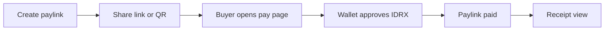
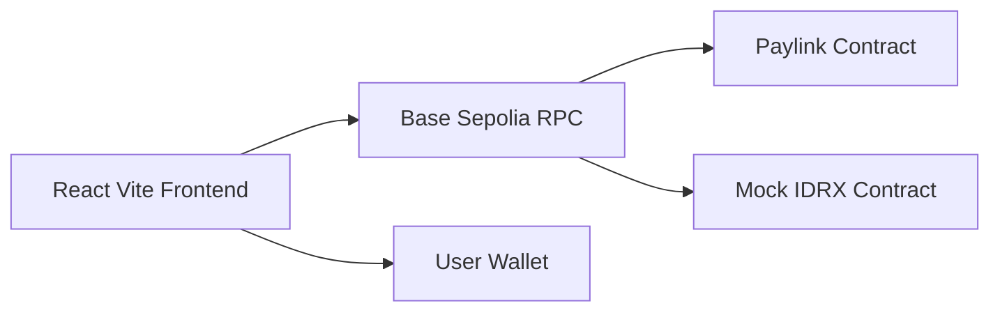

# BayarR


**Tagline:** IDRX Paylink Mini-App

[](https://soliditylang.org/)
[](https://book.getfoundry.sh/)
[](https://react.dev/)
[](https://www.typescriptlang.org/)
[](https://vitejs.dev/)
[](https://tailwindcss.com/)
[](https://base.org/)
[](LICENSE)

[Explore Docs](https://bayar-r-docs.netlify.app/) · View Demo (coming soon) · [Report Bug](https://github.com/hafidluqman50/bayar-r/issues)

**Stack:** React, Vite, Tailwind CSS, OnchainKit, Wagmi, Viem, React Query, Foundry, Solidity  
**Network:** Base Sepolia  
**Language:** TypeScript, Solidity

BayarR is a focused, mobile-first payment link app built on Base Sepolia. It lets a creator generate a one-time IDRX request, share it as a link or QR, and receive onchain payment with a clean receipt.

## Why BayarR

Payment coordination over chat is messy. People bounce between apps, manually confirm payments, and struggle to track status. BayarR compresses the flow into a single onchain link so anyone can pay from their wallet in seconds.

## What It Does

- Create a paylink with amount, note, and expiry.
- Share a clean link or QR to the buyer.
- Buyer pays in IDRX via wallet.
- Receipt shows confirmed status and transaction hash.

Everything important is onchain. The note is stored as a string onchain for full cross-device sync without offchain storage.

## Flow



## Architecture



## Repo Structure

```
/ front-end       # React Vite app
/ smart-contract  # Foundry contracts
/ docs            # Docusaurus documentation
```

## Contracts (Base Sepolia)

- Mock IDRX: `0x5F839e927aFd5ba89408605a1b23F3EaCD6a81ee`
- Paylink: `0xbD7B2A949bcE83B26749129F3cc653208e828bdb`

Update the addresses in `.env` if you deploy your own.

## Frontend Setup

```
cd front-end
npm install
npm run dev
```

**front-end/.env**
```
VITE_BASE_SEPOLIA_RPC_URL=https://base-sepolia.g.alchemy.com/v2/your_key
VITE_WALLETCONNECT_PROJECT_ID=your_project_id
VITE_ONCHAINKIT_API_KEY=your_onchainkit_key
VITE_MOCK_IDRX_ADDRESS=0x...
VITE_PAYLINK_ADDRESS=0x...
```

## Smart Contract Setup

```
cd smart-contract
forge install
forge test
```

**smart-contract/.env**
```
BASE_SEPOLIA_RPC_URL=https://base-sepolia.g.alchemy.com/v2/your_key
PRIVATE_KEY=0x...
MOCK_IDRX_ADDRESS=0x...
BASESCAN_API_KEY=your_key
```

### Deploy Mock IDRX

```
forge script script/DeployMockIDRX.s.sol:DeployMockIDRX --rpc-url base_sepolia --broadcast --verify
```

### Deploy Paylink

```
forge script script/DeployPaylink.s.sol:DeployPaylink --rpc-url base_sepolia --broadcast --verify
```

### Mint Test IDRX

```
cast send <mock_idrx_address> "mint(address,uint256)" <wallet> <amount> --rpc-url base_sepolia --private-key <key>
```

## UX Guardrails

- Creator cannot pay their own link.
- Paid links are locked.
- Expired links are blocked by contract and UI.

## Documentation Site

Docs live in `/docs`.

```
cd docs
npm install
npm run start
```

## License

MIT
