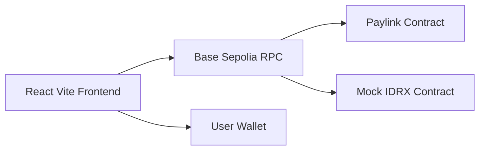
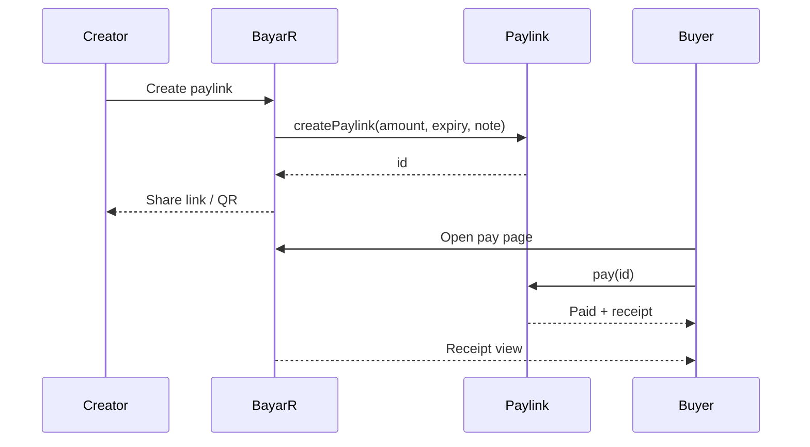

# Architecture

BayarR is a thin frontend on top of simple onchain contracts. It avoids offchain state so the same paylink works across devices.

## Frontend Stack

- **React + Vite**: fast build and local iteration
- **React Router**: clean routes per step
- **Tailwind CSS**: consistent UI and responsive layout
- **OnchainKit**: wallet connection and transaction flow
- **Wagmi + Viem**: contract reads and simulations
- **React Query**: cache and refetch control

## Smart Contracts

- **Paylink.sol**: creates and manages paylinks
- **MockIDRX.sol**: mintable ERC20 for testing on Sepolia

## Key Data Sources

- Paylink data is read from `getPaylink(id)`.
- Receipt status is based on `paid` and `paidAt` from the contract.
- Transaction hash is passed from the pay flow into the receipt URL.

## Sequence Example

