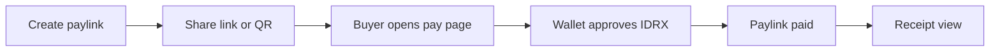
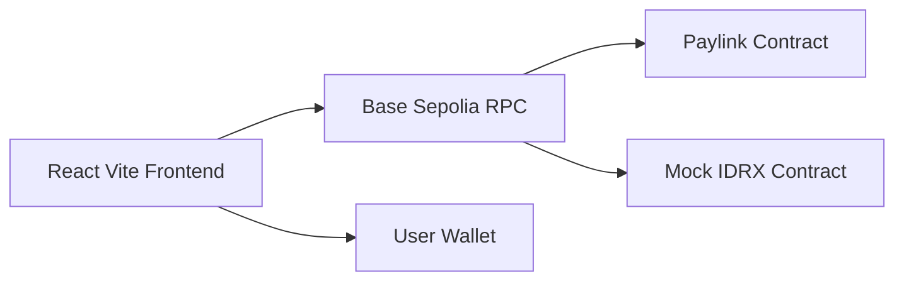

# BayarR

**Tagline:** IDRX Paylink Mini-App

BayarR is a lightweight onchain payment link product built for the Base Indonesia Hackathon. It turns a single IDRX payment request into a shareable link and QR. A buyer can pay directly from their wallet, and the creator receives a clean onchain receipt.

This documentation is the project narrative, not a template. It explains why BayarR exists, the product choices that shaped it, how the system works, and how to run it locally.

---

## What BayarR Solves

Most payment coordination still happens in chat. A creator asks for payment, then:
- Sends bank details.
- Waits for proof.
- Manually confirms.
- Reconciles later.

Web3 can remove the manual steps, but typical dApps introduce complexity (wallet switching, confusing forms, unnecessary features). BayarR keeps the flow intentionally minimal so it feels like a natural extension of chat.

The result is a small, fast, and mobile-first mini-app:



---

## Core Principles

- **One purpose:** collect a single payment with minimum friction.
- **Onchain truth:** the link state and status live onchain.
- **Mobile-first:** layout and copy optimized for small screens.
- **Zero confusion:** remove extra controls, show only what matters.

---

## Technical Snapshot



- Frontend: React + Vite + Tailwind + React Router
- Onchain UX: OnchainKit + Wagmi + Viem
- Contracts: Foundry + OpenZeppelin

---

## Contracts (Base Sepolia)

- Mock IDRX: `0x5F839e927aFd5ba89408605a1b23F3EaCD6a81ee`
- Paylink: `0xbD7B2A949bcE83B26749129F3cc653208e828bdb`

> Update these in `.env` if you deploy your own versions.

---

## Quick Start

```
cd front-end
npm install
npm run dev
```

```
cd smart-contract
forge install
forge test
```

---

## What to Read Next

- **Story and Why Now**: the context and problem framing
- **Product Experience**: UX flow details and choices
- **Architecture**: deeper technical model
- **Smart Contracts**: contract surface and behaviors
- **Build and Run**: full setup and deployment steps
- **Roadmap**: next steps after hackathon
